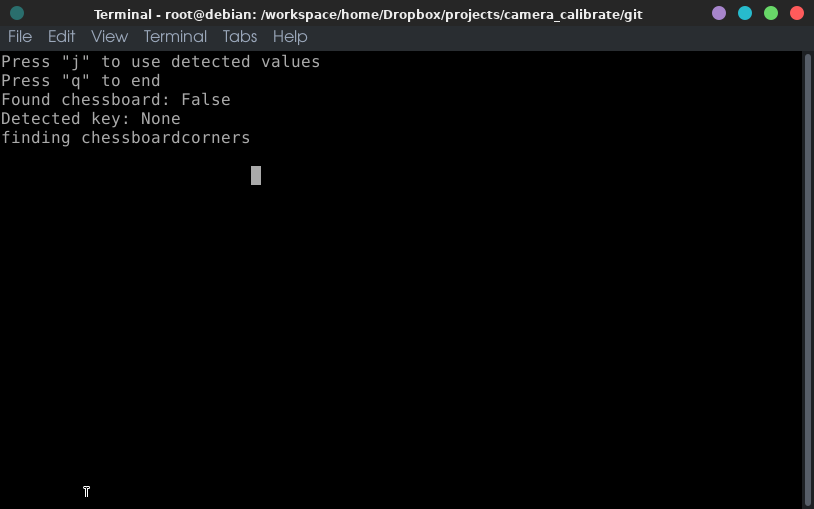
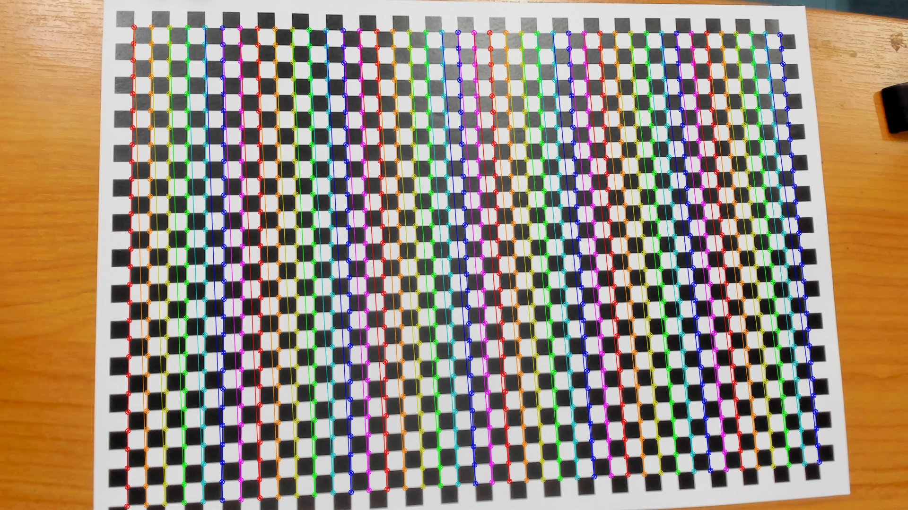

# Easy_Camera_Calibration
A very simple ncurses application to simplify OpenCV camera calibration

Sample Interface



## Setup
Make sure you have OpenCV and numpy installed
Tested on Ubuntu 18.04, Python 3.6 with numpy = 1.18.1 and OpenCV = 4.4
should work with the latest versions

## Config
Config can be edited in `main.py`

`outpath` is the directory where raw and undistorted images would be saved
`crop_dist` is whether or not undistorted images would be edged cropped
`cparams_fn` resulting numpy config file name
`pattern_size` number of chess board vertices in horizontal or vertical direction (interchangable)
`square_size` chessboard block length (I guess a placeholder value should be fine in our use case)
`gray_images` gray or color output images
`dataset` uses a generator class to loop through new images, default value is 0 => /dev/video0

## Running
```
python main.py
```
note: keyboard input should be aimed at the ncurses terminal not the camera terminal
